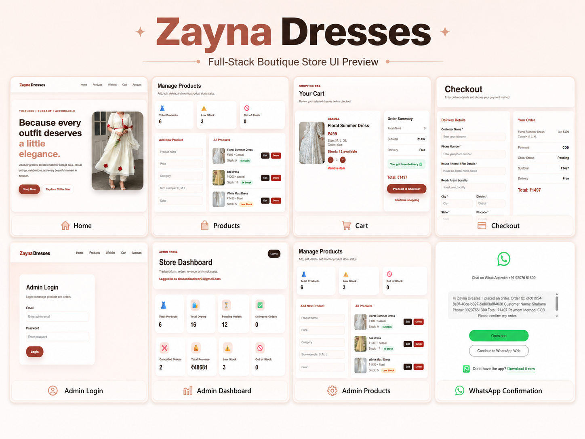

# Zayna Dresses

Zayna Dresses is a full-stack online boutique store built using React, Supabase, and Vercel.  
The website allows customers to browse dresses, add products to cart and wishlist, place orders, write reviews, and manage their account. It also includes an admin panel for managing products, orders, stock, and store activity.

## Live Website

https://store-website-beige.vercel.app

## GitHub Repository

https://github.com/shabana044/store_website

## Preview



## Demo Admin Login

Admin demo access is available for project review.

Email: admin@test.com  
Password: Available on request

## Features

### Customer Features

- Browse all dresses
- Search products by name, color, size, or category
- Filter products by category
- Sort products by price
- View product details
- Add products to cart
- Cart quantity limited by available stock
- Add products to wishlist
- Customer signup and login
- Checkout with detailed address form
- Use current location for delivery
- Google Maps location link
- Cash on Delivery and UPI payment option
- Delivery charge with free delivery above ₹999
- View order history in account page
- Cancel pending orders
- Write product reviews and ratings
- View related products

### Admin Features

- Secure admin login
- Add new products
- Edit product details
- Delete products
- Upload product images
- Manage product stock
- Low-stock and out-of-stock warnings
- View all customer orders
- Search orders by name, phone, or order ID
- Filter orders by status and payment method
- Update order status
- View delivery address, payment details, and Google Maps location
- Dashboard statistics for products, orders, revenue, and stock

## Tech Stack

- React
- Vite
- JavaScript
- React Router
- Supabase Database
- Supabase Auth
- Supabase Storage
- Vercel
- HTML
- CSS

## Database Tables

The project uses the following Supabase tables:

- products
- orders
- order_items
- profiles
- wishlists
- product_reviews

## Main Functionalities

### Product Management

Admins can add, edit, delete, and manage products. Each product includes name, price, category, size, color, description, stock, and image.

### Cart and Checkout

Customers can add products to cart and proceed to checkout. The cart prevents customers from selecting more quantity than the available stock. During checkout, the order total includes delivery charge unless the subtotal is above ₹999.

### Stock Handling

When an order is placed, product stock is reduced automatically. If a pending order is cancelled by the customer, the stock is added back.

### Wishlist

Logged-in customers can save products to their wishlist and remove them later.

### Reviews and Ratings

Logged-in customers can rate products from 1 to 5 stars and write a review. Each customer can update their own review for a product.

### Admin Dashboard

The admin dashboard displays store statistics such as total products, total orders, pending orders, delivered orders, cancelled orders, revenue, low-stock products, and out-of-stock products.

## Installation and Setup

Clone the repository:

```bash
git clone https://github.com/shabana044/store_website.git
```

Go to the project folder:

```bash
cd store_website
```

Install dependencies:

```bash
npm install
```

Create a `.env` file if you do not already have one, and add your Supabase credentials:

```env
VITE_SUPABASE_URL=your_supabase_project_url
VITE_SUPABASE_ANON_KEY=your_supabase_anon_key
```

Run the project locally:

```bash
npm run dev
```

Build the project:

```bash
npm run build
```

## Deployment

The project is deployed using Vercel.

For React Router support on Vercel, the project includes a `vercel.json` file to handle direct route access.

## Future Improvements

- Add real online payment gateway integration
- Add email order confirmation
- Add product image gallery
- Add coupon code system
- Add admin sales charts
- Add invoice download
- Add customer profile editing
- Add product review moderation for admin

## Author

Shabana P  
B.Tech Information Technology Student  
Cochin University of Science and Technology
